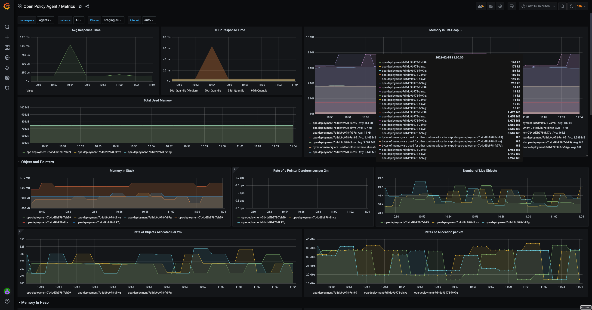

# Open Policy Agent Grafana dashboard

This folder hosts an example on the Grafana dashboard for Open Policy Agent.

It visualizes most of the metrics recorded by Open Policy Agent as documented in 
https://www.openpolicyagent.org/docs/latest/monitoring/

The version of OPA that this is made for is 0.27 or above.

**Notes:** Before you use this dashboard, please mind the variables and the prometheus labels.
These variables and labels may not be applicable in your case so use other names than those provided in this example.
For example: the staging/production datasource, the namespace of the system, etc.

This dashboard is published on Grafana at https://grafana.com/grafana/dashboards/13965. 

