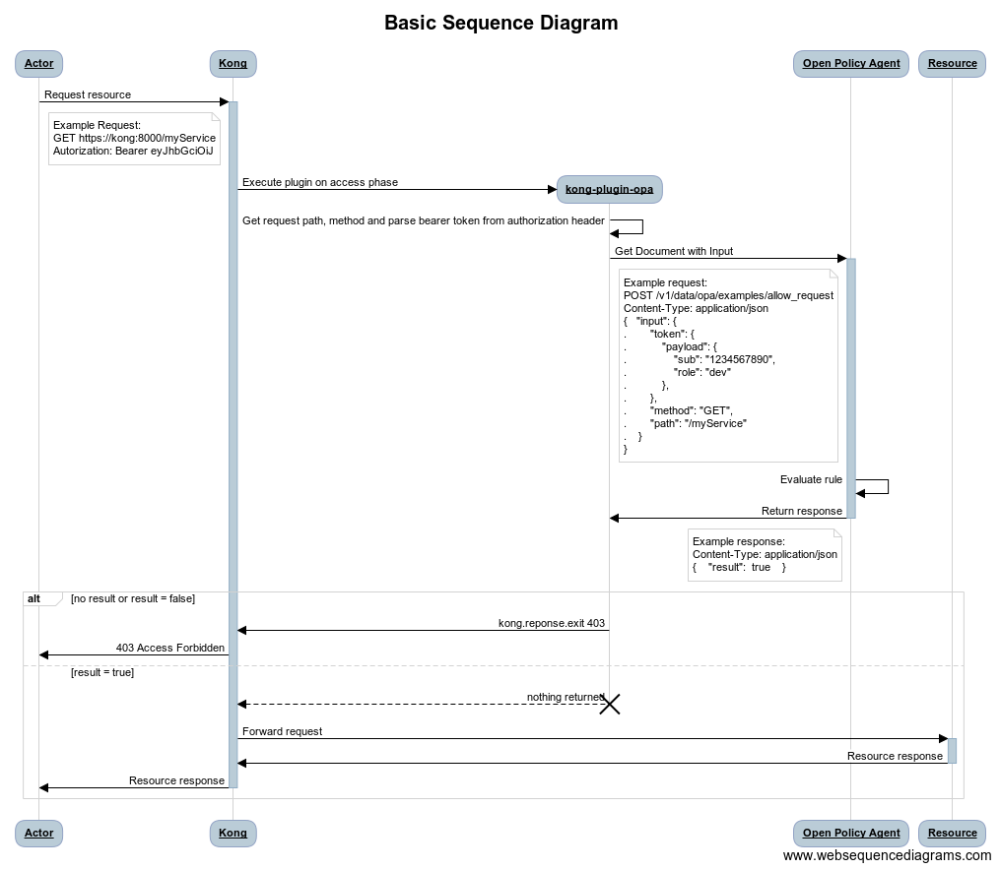

# API Authorization with OPA and Kong

This directory contains a plugin to integrate [OPA](http://www.openpolicyagent.org/) with [Kong API Gateway](https://konghq.com/kong/) to perform API authorization.

The plugin can be enabled on a [Service] or [Route] to authorize access to an upstream service.

This plugin does not verify authentication; it requires an authentication plugin enabled on the [Service] or [Route].

This plugin will:

- authorize access to the upstream service when the policy evaluate successfully
- respond with **403 forbidden** on policy evaluation failure
- respond with a **500 Internal Server Error** on unexcepted error

## Basic Sequence Diagram

---

## Terminology

- `plugin`: a plugin executing actions inside Kong before or after a request has been proxied to the upstream API.
- `Service`: the Kong entity representing an external upstream API or microservice.
- `Route`: the Kong entity representing a way to map downstream requests to upstream services.
- `Upstream service`: this refers to your own API/service sitting behind Kong, to which client requests are forwarded.

## Configuration

This plugin is compatible with requests with the following protocols:

- `http`
- `https`

This plugin is compatible with DB-less mode.

### Enabling the plugin on a Service

#### With a database

Configure this plugin on a [Service] with:

    $ curl -i -X POST http://kong:8001/services/{service}/plugins/ \
    --data 'name=opa' \
    --data 'config.server.host=opa' \
    --data 'config.policy.decision=httpapi/authz/allow'

#### Without a database

Configure this plugin on a [Service] by adding this section to your declarative configuration file:

    plugins:
        - name: opa
          service: {service}
          config:
            server:
                host: opa
            policy:
                decision: httpapi/authz/allow

`{service}` is the `id` or `name` of the [Service] that this plugin configuration will target.

### Enabling the plugin on a Route

#### With a database

Configure this plugin on a [Route] with:

    $ curl -i -X POST http://kong:8001/routes/{route}/plugins/ \
    --data 'name=opa' \
    --data 'config.server.host=opa' \
    --data 'config.policy.decision=httpapi/authz/allow'

#### Without a database

Configure this plugin on a [Route] by adding this section to your declarative configuration file:

    plugins:
        - name: opa
          route: {route}
          config:
            server:
                host: opa
            policy:
                decision: httpapi/authz/allow

`{route}` is the `id` or `name` of the [Route] that this plugin configuration will target.

### Parameters

Here's a list of all the parameters which can be used in this plugin's configuration:

> _required fields are in bold_

form parameter | default | description
--- | --- | ---
`config.server.protocol` | _http_ | The communication protocol to use with OPA Server (`http` or `https`)
`config.server.host` | _localhost_ | The OPA DNS or IP address
`config.server.port` | _8181_ | The port on wich OPA is listening
`config.server.connection.timeout` | _60_ | For the connection with the OPA server: the maximal idle timeout (ms)
`config.server.connection.pool` | _10_ | For the connection with the OPA server: the maximum number of connections in the pool
`config.policy.base_path` | _v1/data_ | The OPA DATA API base path
**`config.policy.decision`** | | The path to the OPA rule to evaluate

---

## Makefile

### Prerequisites

- `docker`: to compile and test the plugin in a container.
- `docker-compose`: to run integration tests with Kong and OPA services.

### Usage

The following list is all targets present in the _Makefile_:

target | description
-- | --
`all` | Execute the whole lifecycle: `check`, `build`, `test`, `verify`
`check` | Analyze code quality
`build` | Build package in current directory using the rockspec
`test`| Run all unit tests
`verify` | Run integration tests
`clean` | Delete all files that are created by running make, including docker images
`mostlyclean` | Like ‘clean’, but do not delete the Docker image built to run other commands
`push` | builds a Kong image with the kong-plugin-opa installed and publishes it

---

## Folder structure

- `./.devcontainer` contains a Docker image that provide a development container with Lua and Luarocks.

  This image is used by _Makefile_ commands.

  For VS Code users, it contains also the configuration to make VS Code access (or create) the container. `luarocks` and `luacheck` commands can then be ran directly from a VS Code terminal.
  
  _(Note: switching between local and in-container commands requires to delete files generated by `luarocks init` since the initialization configure the path to `lua_modules` - this can be done locally with `make mostlyclean`)_
- `./doc` contains assets for the README
- `./integration` contains:
  - a docker-compose example that includes the following services:
    - **kong** with the kong-plugin-opa installed
    - **db** the postgres database used by **kong**
    - **kong-migration** to boostrap de database
    - **opa** running as a server
  - a docker-compose for automated tests, that:
    - creates the **sut** service that will run a postman collection to test the integration
    - configures **kong** to run in DB-less mode with a declarative Kong configuration that setup a Service, Route and enable the plugin
    - loads a simple policies bundle in  **opa** service
    - creates an **Httpbin** service to mock the target upstream service
- `./spec` contains unit tests
- `./src` contains the plugin source code

[Service]: https://docs.konghq.com/latest/admin-api/#service-object
[Route]: https://docs.konghq.com/latest/admin-api/#Route-object
