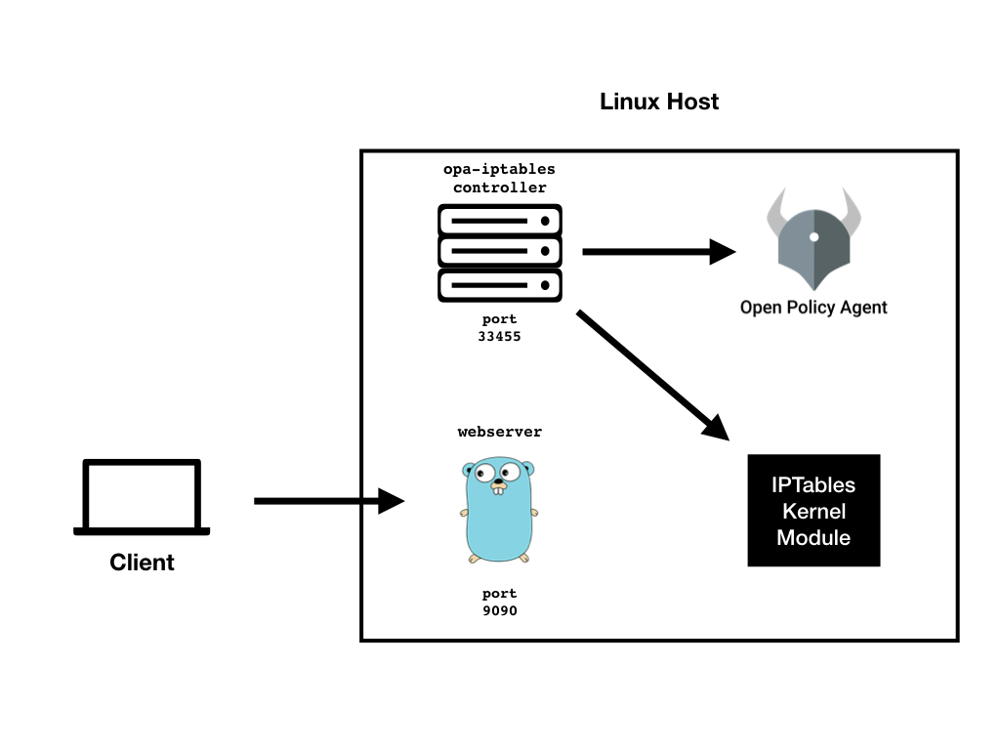

# Managing IPTable rules with OPA

In this tutorial, we going to learn how OPA is useful for managing(insert or delete) IPTable rules. OPA makes it easy to write fine-grained, context-aware policy to manage IPTable rules.
 
## Goals 
In this tutorial, you'll learn how can use OPA to **store**, **retrieve** and **apply** IPTable rules to Linux host.

## Prerequisites
This tutorial required the following components:
- Docker for run OPA
- Linux host

## Steps

## 1. Bootstrap the tutorial environment.

The first step is to run OPA container using docker.
```
# WARNING: OPA is NOT running with an authorization policy configured. This
# means that clients can read and write policies in OPA. If you are
# deploying OPA in an insecure environment, be sure to configure
# authentication and authorization on the daemon. See the Security page for
# details: https://www.openpolicyagent.org/docs/security.html.

docker run -p 8181:8181 openpolicyagent/opa run --server --log-level=debug
```

The second step is to run `opa-iptables` controller to manage IPTable from OPA.

```
sudo opa-iptables -opa-endpoint=http://127.0.0.1:8181 -controller-port=33455
```

## 2. Write an IPTable rules

For this tutorial, We have the following topology:

<p align="center">
  
</p>

Here, nginx is proxying traffic to web-server and web-server is connected to a database.
For security reasons we want following constraints to apply on our host:
- allow SSH(22) traffic to our host
- allow HTTP(80) and HTTPS(443) traffic to our nginx server
- the database only accept traffic from web-server

To apply these constraints, we are going to use IPTables rules. If you are not familiar with how to write IPTable rules then checkout this document [IPTables.md](./IPTables.md)

Following are the IPTable rules for above constrains:

```
[
    {
        "table":"filter",
        "chain":"input",
        "match":["multiport"],
        "protocol":"tcp",
        "destination_port":"80,443,33455,22",
        "jump":"ACCEPT",
        "comment":"allow traffic to port 80(HTTP), 443(HTTPS), 22(SSH), 9090(Web-Server) ,33455(controller)"
    },
    {
        "table":"filter",
        "chian":"input",
        "protocol":"tcp",
        "source":"127.0.0.1",
        "source_port":"9090",
        "destination_port":"5432",
        "jump":"ACCEPT",
        "comment":"only allow traffic to PostgreSQL from web-server"
    }
]
```

## 3. Add `data` document and `policy` into OPA.

Once we have rules, now it's time to add some context to those rules which help to query it from OPA. After that, we are ready for adding it to OPA.

**ruleset.json**:

```
cat > ruleset.json <<EOF
[
    {
        "metadata": {
            "type":"security",
            "environment":"production",
            "owner":"bob"
        },
        "rules": [
            {
                "table":"filter",
                "chain":"input",
                "match":["multiport"],
                "protocol":"tcp",
                "destination_port":"80,443,33455,22",
                "jump":"ACCEPT",
                "comment":"allow traffic to port 80(HTTP), 443(HTTPS), 22(SSH), 9090(Web-Server) ,33455(controller)"
            },
            {
                "table":"filter",
                "chain":"input",
                "protocol":"tcp",
                "source":"127.0.0.1",
                "destination_port":"5432",
                "jump":"ACCEPT",
                "comment":"allow incoming PostgreSQL connections from a specific IP address 127.0.0.1"
            }
        ]
    }
]
EOF
```

Then load the data via OPA’s REST API.

```
curl -X PUT -H "Content-Type: application/json" --data-binary @ruleset.json \
  localhost:8181/v1/data/iptables/ruleset
```

Once we had added data to OPA, it's time to write policy, which is when evaluated returns list of IPTable rules.

**Note: Evaluated Policy must need to return a list of rules describes in JSON**

**security-policy.rego**:

```
cat > security-policy.rego <<EOF
package iptables

import data.iptables.ruleset

get_rules[result] {
    set := ruleset[_]
    set.metadata.type == input.type
    set.metadata.owner == input.owner
    result := set.rules[_]
}
EOF
```

Then load the policy via OPA’s REST API.

```
curl -X PUT --data-binary @security-policy.rego \
  localhost:8181/v1/policies/iptables
```

## 4. Evalute policy and insert/delete/test rules into host

`opa-iptables` controller exposes **webhook** at path `/v0/webhook` for querying rules stored in OPA. The webhook request has following payload:

**Payload:**

- **query_path**: 
        path to policy rule which you wanted to evaluate.
        In above example, query path could be 
    ```
    "iptables/get_rules" i.e. "<path_to_policy>/<rule_name>"
    ```
- **input**: 
        Abritary key-value pair. When you query OPA, you can set the value of the input document which used during policy evaluation.
        Example `input` document:

    ```
    "input" : {
        "owner":"alice",
        "type":"security"
    }
    ```
- **operation**:
        Operation describes what you want to do with IPTable rules returned by query.
        There are three possible values of operation:
    1. **insert**: Insert rules to host.
    2. **delete** : Delete rules from host.
    3. **test**: Validates rules and list out any errors in to stdout.

Let's suppose we want to install all rules, which have type "security" and owned by "bob".

Example Request:

```
curl -X POST \
  http://127.0.0.1:33455/v0/webhook \
  -H 'Content-Type: application/json' \
  -d '{
    "query_path":"iptables/get_rules",
    "input" : {
        "type" : "security",
        "owner" : "bob"
    },
    "operation":"insert"
}'
```

This request inserts IPTable rules into the host.

## Wrap Up
Congratulations on finishing the tutorial!

You learned many things about managing IPTable rules with OPA:

1. With `opa-iptables` extension you can easily query OPA and Insert/Delete rules to Linux host.
2. You can store all of your IPTables rules in one centralized place(in OPA). 
3. Add Context to those rules and write fine-grain policy to fetch rules.

The code for this tutorial can be found in the [open-policy-agent/contrib/opa-iptables](https://github.com/open-policy-agent/contrib/tree/master/opa-iptables) repository.
