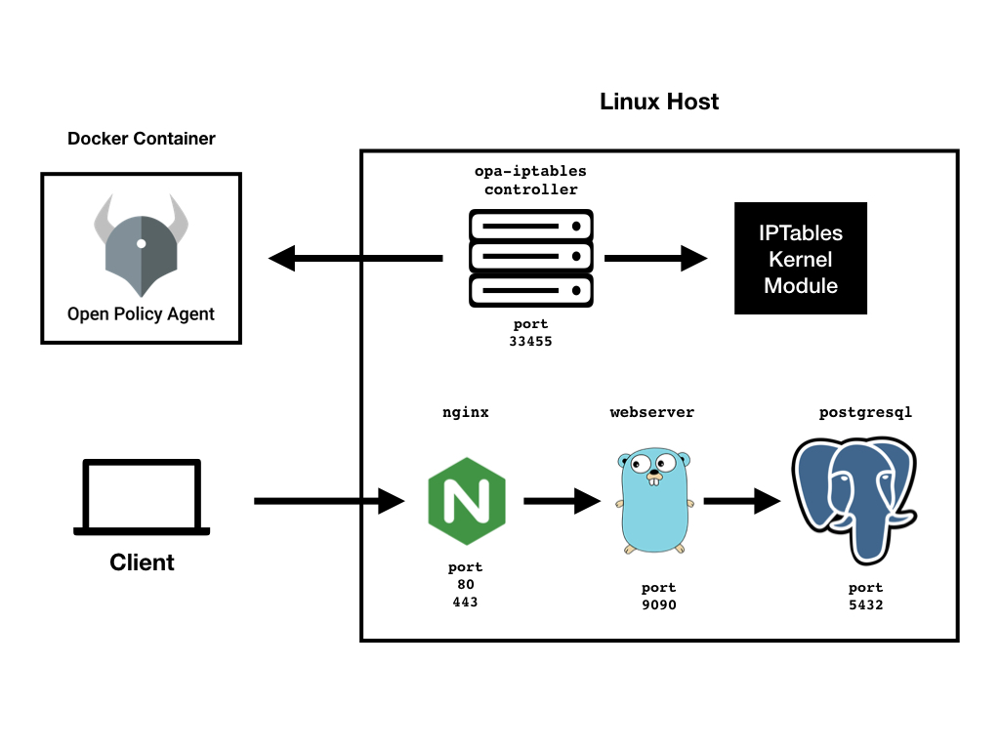

# Managing IPTable rules with OPA

In this tutorial, we are going to learn how OPA is useful for managing(insert or delete) IPTable rules. OPA makes it easy to write fine-grained, context-aware policy to manage IPTable rules.
 
## Goals 
In this tutorial, you'll learn how can use OPA to **store**, **retrieve** and **apply** IPTable rules to Linux host.

## Prerequisites
This tutorial requires the following components:
- [Docker](https://docs.docker.com/install/)
- [Docker Compose](https://docs.docker.com/compose/install/)
- Linux host

## Steps

## 1. Bootstrap the tutorial environment using Docker Compose.

First, create a docker-compose.yml file that runs OPA and the demo web server.

**docker-compose.yml**:

```
version: '3'
services:
  opa:
    container_name: opa
    image: openpolicyagent/opa:0.12.1
    ports:
      - 8181:8181
    # WARNING: OPA is NOT running with an authorization policy configured. This
    # means that clients can read and write policies in OPA. If you are
    # deploying OPA in an insecure environment, be sure to configure
    # authentication and authorization on the daemon. See the Security page for
    # details: https://www.openpolicyagent.org/docs/security.html.
    command:
      - "run"
      - "--server"
      - "--log-level=debug"
  example_server:
    container_name: web-server
    image: urvil38/opa-iptables-example
    ports:
      - 9090:9090
    environment:
      - PORT=9090
  opa-iptables:
    container_name: opa-iptables
    image: urvil38/opa-iptables:0.0.1-dev
    cap_add:
      - NET_ADMIN
    network_mode: host
    command:
      - "-log-level=debug"
```
Then run docker-compose to pull and run the containers.
```
docker-compose -f docker-compose.yml up
```

## 2. Write IPTable rules

For this tutorial, We have the following topology:

<p align="center">
  
</p>

This Demo Web Server is written in `Go`, for showing the functionality of IPTable rules. This server has one root endpoint. Using `curl` or `browser` you can make a request to that endpoint.

**Using curl:**

```
curl localhost:9090/
```

You get the following Response:

**Response:**

```
Server is running on port: 9090
Hello world!!
```

For Demo purpose, we want to drop all the traffic to this web server. [IPTables](./IPTables.md) is a swiss-army knife for doing this kind of stuff. i.e manipulating traffic(packets) of Layer 4(TCP/IP).

IPtable rule for doing this look like as following:

```
1. iptables -t FILTER -A INPUT -p tcp --dport 9090 -j DROP -m comment --comment "drop all traffic to web server"

2. iptables -t FILTER -A INPUT -p tcp --dport 33455 -j ACCEPT -m comment --comment "always allow any traffic to our opa-iptables plugin"
```

>Note: `opa-iptables` plugin uses JSON representation of IPTable rules for storing and querying rules. You can convert the following rule to JSON representation as described in this [document](./IPTables.md) manually `OR` opa-iptables also provides a handly endpoint for doing the same thing. It has `/iptables/json` endpoint which returns JSON representation of rules.

```
curl -X POST localhost:33455/iptables/json -d \
'iptables -t FILTER -A INPUT -p tcp --dport 9090 -j DROP -m comment --comment "drop all traffic to web server"\n 
iptables -t FILTER -A INPUT -p tcp --dport 33455 -j ACCEPT -m comment --comment "always allow any traffic to our opa-iptables plugin"'
```

You get following Response:

```
[{
    "table": "filter",
    "chain": "INPUT",
    "destination_port": "9090",
    "jump": "DROP",
    "protocol": "tcp",
    "tcp_flags": {},
    "ctstate": [
        ""
    ],
    "match": [
        "comment"
    ],
    "comment": "drop all traffic to web servern"
},
{
    "table": "filter",
    "chain": "INPUT",
    "destination_port": "33455",
    "jump": "ACCEPT",
    "protocol": "tcp",
    "tcp_flags": {},
    "ctstate": [
        ""
    ],
    "match": [
        "comment"
    ],
    "comment": "always allow any traffic to our opa-iptables plugin"
}]
```

## 3. Add `data` and `policy` into OPA.

Once we have rules, now it's time to add some context to those rules which help to query it from OPA. After that, we are ready for adding it to OPA using OPA's REST API.

**ruleset.json**:

```
cat > ruleset.json <<EOF
[
    {
        "metadata": {
            "type":"security",
            "environment":"production",
            "owner":"bob"
        },
        "rules": 
        [
          {
            "table": "filter",
            "chain": "INPUT",
            "destination_port": "9090",
            "jump": "DROP",
            "protocol": "tcp",
            "tcp_flags": {},
            "ctstate": [
                ""
            ],
            "match": [
                "comment"
            ],
            "comment": "drop all traffic to web server"
          },
          {
            "table": "filter",
            "chain": "INPUT",
            "destination_port": "33455",
            "jump": "ACCEPT",
            "protocol": "tcp",
            "tcp_flags": {},
            "ctstate": [
                ""
            ],
            "match": [
                "comment"
            ],
            "comment": "always allow any traffic to our opa-iptables plugin"
          }
        ]
    }
]
EOF
```

Then load the data via OPA’s REST API.

```
curl -X PUT -H "Content-Type: application/json" --data-binary @ruleset.json \
  localhost:8181/v1/data/iptables/ruleset
```

Once we had added data to OPA, it's time to write policy, which is when evaluated returns list of IPTable rules.

**Note: Evaluated Policy must need to return a list of rules describes in JSON**

**security-policy.rego**:

```
cat > security-policy.rego <<EOF
package iptables

import data.iptables.ruleset

webserver_rules[result] {
    set := ruleset[_]
    set.metadata.type == input.type
    set.metadata.owner == input.owner
    result := set.rules[_]
}
EOF
```

Then load the policy via OPA’s REST API.

```
curl -X PUT --data-binary @security-policy.rego \
  localhost:8181/v1/policies/iptables
```

## 4. Evaluate policy and insert/delete rules into the host

Let's suppose we want to install all rules, which have type "security" and owned by "bob".

Example Request:

```
curl -X POST \
  http://127.0.0.1:33455/iptables/insert?q=iptables/webserver_rules \
  -H 'Content-Type: application/json' \
  -d '{
    "input" : {
        "type" : "security",
        "owner" : "bob"
    }
}'
```

This request inserts IPTable rules into the host.

**How can I confirm that this request will insert rules into the kernel?**

There are multiple ways to ensure this:

1. Checkout Log output of `opa-iptables` plugin.

```
INFO[2019-07-19 14:24:32] msg="Received Request" req_method=POST req_path=/iptables/insert?q=iptables/webserver_rules 
INFO[2019-07-19 14:24:32] Inserted 2 out of 2 rules (2/2)
```

2. List out rules in specific table/chain using `/iptables/list/{table_name}/{chain_name}` endpoint:

```
curl http://127.0.0.1:33455/iptables/list/filter/input
```

You get following Response:

```
-P INPUT ACCEPT
-A INPUT -p tcp -m tcp --dport 9090 -m comment --comment "\"drop all traffic to web server\"" -j DROP
-A INPUT -p tcp -m tcp --dport 33455 -m comment --comment "\"always allow any traffic to our opa-iptables plugin\"" -j ACCEPT
```

These are the rules which we have inserted. Right! 

Now let's double-check that rules are inserted into the kernel by making to an HTTP request to our webserver:

```
curl http://localhost:9090/
```

**Result: You get nothing back as this HTTP request is blocked by our iptable rule.**

## Clean Up

1. Delete All rules which we inserted before, using the following request:

```
curl -X POST \
  http://127.0.0.1:33455/iptables/delete?q=iptables/webserver_rules \
  -H 'Content-Type: application/json' \
  -d '{
    "input" : {
        "type" : "security",
        "owner" : "bob"
    }
}'
```

2. After deleting rules you can check that rules are successfully deleted by making an request to web server and you will get your response as you expected.

**Using curl:**

```
curl localhost:9090/
```

**Response:**

```
Server is running on port: 9090
Hello world!!
```


3. Stop all containers using `docker-compose -f docker-compose.yml down`

## Wrap Up
Congratulations on finishing the tutorial!

You learned many things about managing IPTable rules with OPA:

1. With `opa-iptables` extension you can easily query OPA and Insert/Delete rules to Linux host.
2. You can store all of your IPTables rules in one centralized place(in OPA). 
3. Add Context to those rules and write fine-grain policy to fetch rules.

The code for this tutorial can be found in the [open-policy-agent/contrib/opa-iptables](https://github.com/open-policy-agent/contrib/tree/master/opa-iptables) repository.