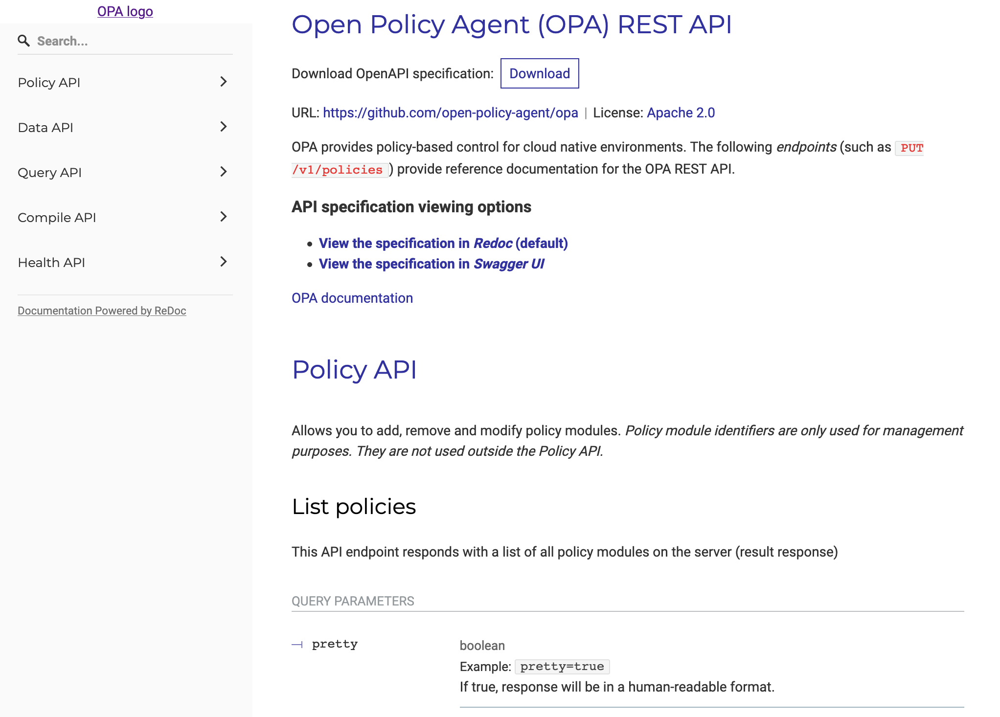

# OpenAPI Specification for OPA

Full OpenAPI specifications for the endpoints exposed by OPA's REST API.

This may be used to generate API clients for languages and platforms not currenly supported by existing integrations, or simply just as an excellent resource for documentation.

## Swagger UI

To explore the OPA REST API through Swagger UI, simply start at web server in the root direcotry of the module. Example using Python 3:

```shell
python3 -m http.server
```
The docs will then be browsable on localhost:8000.



